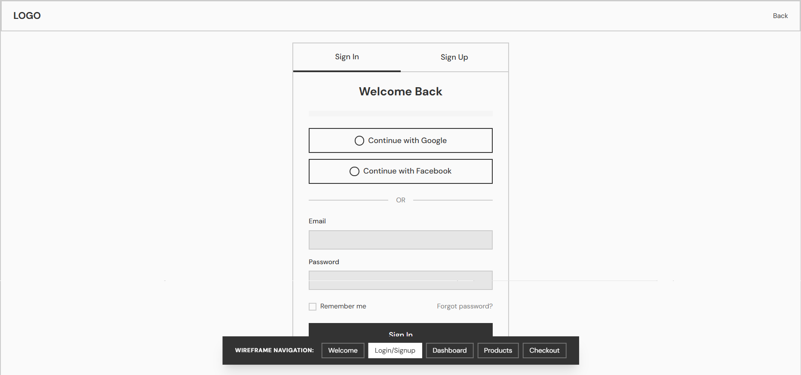

# UI-UX-Experiment4

## Aim:

To design a low-fidelity wireframe for a generic web or mobile application using Balsamiq, consisting of five main screens: Welcome, Login/Signup, Dashboard, Product Listing, and Checkout, focusing on structure, navigation, and layout.

## Algorithm:

1. Open Balsamiq Wireframes and create a new project.

2. Design the Welcome Screen with logo, title, and navigation buttons.

3. Create the Login/Signup Screen with input fields and authentication buttons.

4. Design the Dashboard Screen showing analytics, navigation menu, and data cards.

5. Add a Product Listing Screen displaying products in grid layout with “Add to Cart” options.

6. Finally, design the Checkout Screen with order summary, payment, and address details.

## Output:

 

 

 

## Result:
The wireframe for a generic application was successfully designed using Balsamiq.
It includes five essential screens with a clear and consistent navigation structure.
The layout effectively demonstrates the user flow from Welcome to Checkout.